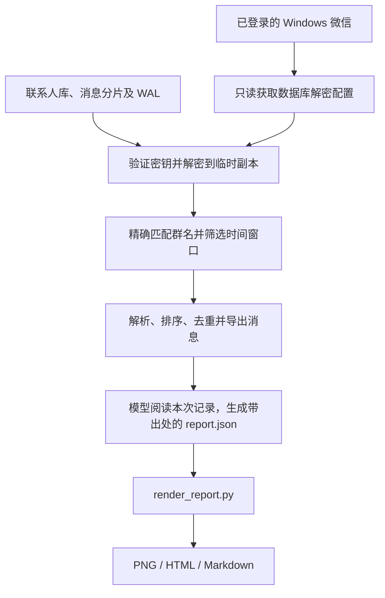

# 获取微信群聊天记录，并自动生成总结报告 · WeChat Group Report

一个可复用的 AI Skill：读取 Windows 微信中指定群的**本地已同步记录**，整理主要话题、结论和待办，一次生成 **PNG 长图、离线 HTML 网页和 Markdown 摘要**，每条结论都带真实消息编号可核对。

```text
使用 $wechat-group-report，读取"我的项目群"最近 48 小时记录，
生成 PNG 和网页版总结报告。
```

这是由 AI 会话协调的工作流：Python 负责读取与渲染，模型负责理解并总结消息。项目**没有**内置模型 API 调用、无人值守调度或自动发消息功能。

## 示例效果

下图及 `examples/synthetic/` 中所有消息均为**完全虚构的演示数据**，不来自任何真实微信群。


同一份内容还会生成 [离线网页示例](examples/synthetic/index.html) 和 [Markdown 示例](examples/synthetic/summary.md)。下载 HTML 后可直接在浏览器打开，无需启动服务。

## 功能

- 按群名精确匹配，默认最近 24 小时，可指定时长（48/72 小时）、历史截止时间和已核实的群 ID。
- 读取联系人库、消息分片和 WAL 增量；检查结构完整性、时间窗口、发送者映射和重复记录。
- 解析文本、引用和可解析卡片；每个报告条目引用本次真实消息编号，HTML 中可回看来源。
- 严格区分已确认、已接收、待完成、个人观点和报告建议；没有明确负责人或截止时间就写"未明确"。
- PNG 按正文实际高度排版，HTML 响应式且无外部资源依赖，两者与 Markdown 使用同一份正文。
- 密钥不写入文件，临时解密副本正常退出时清理，原微信数据库**只读**。

## 环境与兼容性

| 项目 | 范围 |
|---|---|
| 读取系统 | Windows，微信桌面客户端已登录 |
| 实际验证版本 | 微信 4.1.13.65 |
| Python | 在 Python 3.13 上验证；代码使用 Python 3.10+ 语法 |
| 依赖 | cryptography、zstandard、Pillow，版本见 `scripts/requirements.txt` |
| 中文字体 | 默认使用 Windows 微软雅黑，可用 `--font` 指定其他字体 |
| macOS | 当前读取器不支持，不能直接照搬 Windows 方案 |

微信更新可能导致内存结构变化，需要重新适配。**手机上存在的记录不一定已同步到电脑**；数据库完整性检查通过也不能证明同步完整，报告会说明实际读取范围。

## 安装

### 方式一：交给 AI 安装（推荐）

把本仓库地址发给你的 AI 助手，让它安装到本机技能目录即可。

### 方式二：手动安装

Windows PowerShell：

```powershell
$skillDir = Join-Path $HOME '.workbuddy\skills\wechat-group-report'
git clone https://github.com/yulin0518/wechat-group-report.git $skillDir
Set-Location -LiteralPath $skillDir
```

然后**一条命令**备好环境和配置：

```powershell
python scripts\bootstrap.py
```

`bootstrap.py` 会自动完成：创建技能自带 venv、安装依赖、探测微信数据目录、按消息库最后修改时间选中**当前活跃账号**、写出 `settings.local.json`。

多账号机器上务必确认选中的账号正确：

```powershell
# 指定账号重新生成配置
python scripts\bootstrap.py --account "wxid_xxxxxxxx" --self-name "你的群昵称" --force
```

已有配置不会被覆盖，除非加 `--force`。

<details>
<summary>手动填写配置（不使用 bootstrap）</summary>

```powershell
python -m venv .venv
.\.venv\Scripts\python.exe -m pip install -r scripts\requirements.txt
Copy-Item -LiteralPath settings.example.json -Destination settings.local.json
```

编辑 `settings.local.json`：

```json
{
  "db_dir": "C:/Users/YOUR_NAME/Documents/xwechat_files",
  "account": "YOUR_ACCOUNT_DIRECTORY",
  "self_name": "你的显示名",
  "output_root": "D:/wechat-reports",
  "default_group": "我的项目群"
}
```

`db_dir` 是包含账号目录的父目录；`account` 是该目录下、包含 `db_storage` 的账号文件夹名。通过微信的「文件存储位置」设置核对实际路径，**不要复制别人的账号标识**。

</details>

安装后在 AI 会话中调用该 Skill。若新技能未显示，重启客户端；Skill 会优先使用自身目录中的 `.venv\Scripts\python.exe`。

## 常用请求

```text
总结"我的项目群"最近 24 小时，生成 PNG 和网页。

总结"我的项目群"最近 48 小时，重点列出待回复事项。

总结"我的项目群"截至 2026-01-02T12:00:00+08:00 往前 24 小时的记录。
```

"网页版"默认是本地 HTML。若另需**公开分享链接**，应明确要求发布，并确认报告内容适合分享；本 Skill 不默认上传原始记录、数据库或个人配置。

## 手动运行与实现流程



完整复用流程（命令行）：

```powershell
# 0. 首次 / 换机：建环境、选账号、写配置
python scripts\bootstrap.py

# 1. 不知道确切群名时，先列出本机群聊
.\.venv\Scripts\python.exe scripts\list_groups.py --limit 30

# 2. 读取指定群（默认最近 24 小时），输出目录即 RUN_DIR
.\.venv\Scripts\python.exe scripts\read_group.py --group "我的项目群" --hours 48

# 3. 读 RUN_DIR 里的 messages.txt 全文，按报告结构写 report.json

# 4. 渲染 + 校验一步完成，并列出交付文件
.\.venv\Scripts\python.exe scripts\finish_report.py --run-dir "D:\wechat-reports\<RUN_DIR>"
```

**渲染器不会自行调用模型或生成摘要**，`report.json` 由 AI 会话按 [报告结构](references/report-schema.md) 撰写；也可以由你手工编写。

| 读取参数 | 含义 |
|---|---|
| `--group` | 必填的准确群名 |
| `--hours` | 回溯小时数，默认 24 |
| `--end` | 含时区的 ISO 8601 截止时间（窗口含起点、不含终点） |
| `--group-id` | 核实同名群身份后指定 ID；仍需准确匹配群名 |
| `--db-dir` / `--account` | 覆盖本地数据库位置与账号 |
| `--self-name` | 明确本账号"我"的显示名 |
| `--output-root` | 独立运行目录的父目录 |

渲染参数另有 `--out-dir`、`--report`、`--font` 和 `--bold-font`。遇到多个同名群时先核对身份，不合并不同群，也不凭群名猜测。解密细节及来源见 [sources.md](references/sources.md)。

## 交付约定

- **默认只交付一张完整长图 `report.png`**：按内容实际高度排版，不裁切、不拼接。
- 不主动分图。`scripts/split_png.py` 带保护，缺少 `--force` 会直接拒绝执行；分图只是额外产物，不替代完整长图。
- 每次运行生成独立目录，包含 `messages.json`、`messages.txt`、`report.json`、`summary.md`、`index.html`、`report.png`。

## 无需微信的演示与检查

```powershell
.\.venv\Scripts\python.exe scripts\render_report.py --run-dir examples\synthetic --out-dir wechat-reports\demo
.\.venv\Scripts\python.exe -m unittest discover -s tests -v
```

演示使用虚构数据，测试不连接微信、不访问真实聊天记录、不需要密钥。渲染器会拒绝不存在的消息引用、重复原始编号、错误统计和超出窗口的消息；语义是否真的支撑结论仍需模型和使用者核对。

校验某次运行的自洽性：

```powershell
.\.venv\Scripts\python.exe scripts\verify_run.py --run-dir "D:\wechat-reports\<RUN_DIR>"
```

## 数据边界与隐私

- 仅用于**本人账号**或已获授权的记录。本工具不发送消息、不修改微信、不降低系统保护。
- 读取与渲染在本机完成，但 AI 分析会处理所提供的消息文本，因此整条流程**不是完全离线**。
- 密钥只在读取时从微信进程内存短暂取用，经校验后使用；不写入日志、配置、报告或代码仓库。
- 原微信数据库始终只读，解密使用独立临时副本，正常退出与启动时都会清理。
- 图片、音视频内部内容默认不识别，只保留消息标记和已有的微信语音转写；**不会声称读过图片**。

`settings.local.json`、数据库、密钥文件、导出的真实消息和运行目录均不应提交到 Git（`.gitignore` 已覆盖）。**不要在 Issue 中上传原始数据库、密钥或未脱敏聊天记录**；故障反馈请提供系统版本、微信版本和脱敏后的错误信息。

## 故障排查

| 现象 | 排查方向 |
|---|---|
| 找不到微信数据目录 | 用 `--db-dir` 指定；或在微信「设置 → 文件管理」查看实际存储位置 |
| 读不到消息 | 确认微信已登录、手机记录已同步到电脑；检查账号目录是否选对 |
| 群名匹配不到 | 先用 `list_groups.py` 列群；同名群用 `--group-id` 消歧 |
| 密钥获取失败 | 微信升级后内存结构可能变化，需要适配；确认用的是当前登录账号 |
| 中文变方块 | 用 `--font` / `--bold-font` 指定本机存在的中文字体 |
| 依赖缺失 | 重跑 `bootstrap.py`，或手动 `pip install -r scripts/requirements.txt` |

## 许可证与致谢

Apache-2.0，见 [LICENSE](LICENSE) 和 [NOTICE](NOTICE)。

本项目的数据库读取来自 [wechatauto-replica](https://github.com/fanyuantaier/wechatauto-replica)，消息解析来自 [wechat-chat-export](https://github.com/zhuzhangxue/wechat-chat-export)，均固定到具体提交并随源码保留其原始 LICENSE 与第三方声明。本仓库未捆绑上游可选的语音模型或二进制程序。

在上游项目基础上，本仓库新增了 `bootstrap.py`、`finish_report.py`、`list_groups.py`、`verify_run.py`、`split_png.py`，并修复了 `read_group.py` 在 Windows 上解密临时副本可能残留的问题；修改明细见 [NOTICE](NOTICE)。

原始项目由 [Tina2088](https://github.com/Tina2088/wechat-group-report) 创建，本仓库为其衍生版本。

这是独立社区项目，与腾讯、微信、OpenAI 无隶属或官方背书关系。
